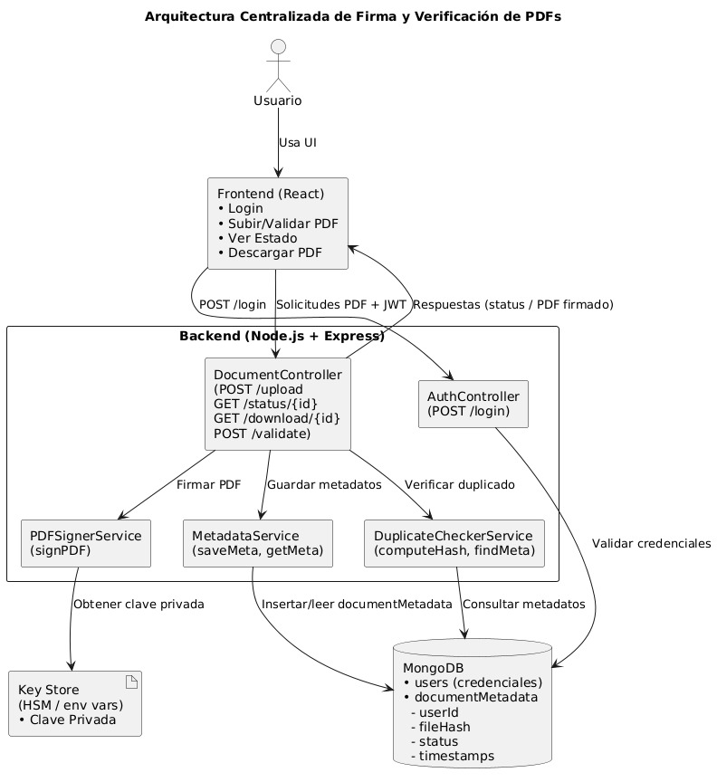

# Sistema de Firmas Electrónicas

Este proyecto es un sistema web diseñado para la gestión y futura implementación de firmas electrónicas en documentos PDF. Cuenta con una arquitectura de cliente-servidor (frontend y backend) que permite a los usuarios subir, visualizar, descargar y eliminar documentos, con una base sólida para expandirse a funcionalidades de firma digital.

## Características Actuales

- **Autenticación de Usuarios:** Registro, inicio y cierre de sesión seguro mediante tokens JWT.
- **Gestión de Documentos:**
  - Subida de documentos PDF.
  - Visualización de documentos en el navegador.
  - Descarga de documentos.
  - Eliminación de documentos (borrado suave).
  - **Documentos asociados a usuarios:** Cada usuario solo puede gestionar sus propios documentos.
- **Gestión de Certificados Digitales:**
  - Subida de certificados digitales (.p12) con cifrado seguro.
  - Generación de certificados digitales personalizados desde la interfaz web.
  - Descarga de certificados generados.
  - **Lista de certificados:** Visualización de todos los certificados del usuario.
  - **Descarga segura:** Descarga de certificados almacenados con validación de contraseña.
  - **Eliminación de certificados:** Gestión completa del ciclo de vida de certificados.
  - Almacenamiento seguro con cifrado AES-256-CBC.
- **Modo Oscuro/Claro:** Interfaz adaptable a las preferencias del usuario.

## Arquitectura del Sistema

El sistema sigue una arquitectura de componentes separados para el frontend y el backend, comunicándose a través de una API RESTful.



## Estructura del Backend (Node.js con Express y MongoDB)

El backend está construido con Node.js, utilizando el framework Express para las rutas API y Mongoose como ODM para interactuar con una base de datos MongoDB.

-   **`backend/src/app.js`**: Archivo principal de la aplicación. Configura Express, los middlewares y las rutas principales.
-   **`backend/src/config/db.js`**: Contiene la lógica para establecer la conexión con la base de datos MongoDB utilizando Mongoose.
-   **`backend/src/models/`**: Define los esquemas y modelos de Mongoose para las colecciones de la base de datos:
    -   `Usuario.js`: Define el esquema de usuario.
    -   `Documento.js`: Define el esquema de documento, incluyendo `nombre`, `ruta`, `usuario` (referencia al userId), `hash` (para verificar integridad futura), `estado` (activo/eliminado) y timestamps (`createdAt`, `updatedAt`).
    -   `TokenInvalidado.js`: Almacena tokens JWT que han sido invalidados (ej. por logout).
-   **`backend/src/controllers/`**: Contiene la lógica de negocio para manejar las solicitudes de los clientes. Aquí se procesan las operaciones relacionadas con usuarios (registro, login, logout), documentos (subir, listar, ver, eliminar) y certificados (subir, generar, listar, descargar, eliminar), asegurando que cada usuario interactúe solo con sus propios recursos y con borrado suave para documentos.
-   **`backend/src/api/`**: Define las rutas específicas de la API para cada recurso. Por ejemplo, `usuarioRoutes.js`, `documentoRoutes.js` y `certificadoRoutes.js` manejan las operaciones CRUD para usuarios, documentos y certificados, respectivamente.
-   **`backend/src/middleware/`**: Contiene middlewares como `auth.js` para la verificación de tokens JWT y la protección de rutas.
-   **`backend/src/utils/`**: Contiene utilidades como `CertificateManager.js` para el manejo seguro de certificados digitales (cifrado, descifrado, almacenamiento).
-   **`backend/uploads/`**: Directorio donde se almacenan físicamente los documentos PDF subidos por los usuarios.
-   **`backend/CrearCertificado/`**: Scripts para generar certificados de prueba desde la línea de comandos.

## Estructura del Frontend (React con TypeScript y Tailwind CSS)

El frontend es una aplicación de React construida con TypeScript y estilizada con Tailwind CSS, ofreciendo una experiencia de usuario moderna y responsiva.

-   **`frontend/src/App.tsx`**: Componente raíz de la aplicación. Configura el enrutamiento (`react-router-dom`), provee el contexto del tema y la autenticación a toda la aplicación.
-   **`frontend/src/pages/`**: Contiene los componentes de página de nivel superior que corresponden a las rutas de la aplicación (ej. `LoginPage.tsx`, `RegisterPage.tsx`).
-   **`frontend/src/components/`**: Almacena componentes UI reutilizables. Esto incluye subcarpetas para:
    -   **`components/home/`**: Contiene `HomePage.tsx`, la página principal para la gestión de documentos y certificados.
    -   **`components/layout/`**: Componentes relacionados con el diseño general de la aplicación, como la barra de navegación (`Navigation.tsx`) y notificaciones (`Notification.tsx`).
    -   **`components/documentos/`**: Componentes específicos para la interacción con documentos, como `DocumentUpload.tsx` (subida), `DocumentList.tsx` (listado) y `PDFViewer.tsx` (visor).
    -   **`components/certificados/`**: Componentes específicos para la gestión de certificados digitales, como `CertificateUpload.jsx` (subida), `CertificateGenerator.jsx` (generación), y `CertificateList.jsx` (listado y gestión).
    -   **`components/auth/`**: Componentes de autenticación como formularios de login y registro.
    -   **`components/login/`** y **`components/register/`**: Páginas específicas para autenticación.
-   **`frontend/src/context/ThemeContext.tsx`**: Provee un contexto React para gestionar el estado del tema (claro/oscuro) a través de la aplicación.
-   **`frontend/src/services/api.ts`**: Contiene los servicios para interactuar con la API del backend, incluyendo `authService` para la autenticación y `documentoService` para las operaciones de documentos. Utiliza Axios para las peticiones HTTP.
-   **`tailwind.config.js`**: Archivo de configuración de Tailwind CSS, donde se definen las rutas de los archivos que Tailwind debe escanear para generar los estilos, y se pueden personalizar colores, tipografías, etc.

## Próximos Pasos (Firma Electrónica)

La base actual está diseñada para facilitar la futura integración de funcionalidades de firma electrónica, que incluirán:
- Generación y gestión de firmas digitales.
- Aplicación de firmas a documentos PDF.
- Verificación de la autenticidad de los documentos firmados.

## Configuración y Ejecución

Para levantar el proyecto, sigue los siguientes pasos:

### Backend

1.  Navega a la carpeta `backend`:
    `cd backend`
2.  Instala las dependencias:
    `npm install`
3.  Inicia el servidor (asegúrate de que MongoDB esté corriendo):
    `node src/app.js`

### Frontend

1.  Navega a la carpeta `frontend`:
    `cd frontend`
2.  Instala las dependencias:
    `npm install`
3.  Inicia la aplicación React:
    `npm run dev`

La aplicación estará disponible en `http://localhost:5173` (frontend) y la API en `http://localhost:3001/api` (backend).

### Rutas Disponibles

#### Frontend
- **`/`** - Página de login (redirige desde la raíz)
- **`/login`** - Página de inicio de sesión
- **`/register`** - Página de registro
- **`/home`** - Página principal con gestión de documentos y certificados
- **`/certificado`** - Subida de certificados digitales
- **`/generar-certificado`** - Generación de certificados personalizados
- **`/mis-certificados`** - Gestión de certificados almacenados

#### Backend API
- **`/api/usuarios/*`** - Gestión de usuarios (login, registro, logout)
- **`/api/documentos/*`** - Gestión de documentos PDF
- **`/api/certificados/*`** - Gestión de certificados digitales

## Notas
- Asegúrate de tener MongoDB corriendo localmente en el puerto 27017.
- El archivo `.gitignore` está configurado para ignorar dependencias, archivos sensibles y la carpeta `backend/uploads/` donde se guardan los PDFs.

## Generar un certificado de prueba (.p12)

En la carpeta `backend/CrearCertificado` se encuentra el script `crear_certificado_prueba.sh` que permite generar un certificado digital de prueba en formato `.p12`.

### ¿Qué hace el script?
- Genera una clave privada RSA de 2048 bits.
- Crea un certificado autofirmado.
- Empaqueta la clave y el certificado en un archivo `.p12` protegido con contraseña.
- Muestra los detalles del certificado generado.

### ¿Cómo ejecutarlo?

1. Abre una terminal y navega a la carpeta del script:
   ```bash
   cd backend/CrearCertificado
   ```
2. Da permisos de ejecución al script (solo la primera vez):
   ```bash
   chmod +x crear_certificado_prueba.sh
   ```
3. Ejecuta el script:
   ```bash
   ./crear_certificado_prueba.sh
   ```

Esto generará los archivos `Hola.key`, `Hola.crt` y `Hola.p12` en la misma carpeta. La contraseña por defecto del archivo `.p12` es `123456` (puedes modificarla editando el script).

## Generar Certificados desde la Interfaz Web

El sistema incluye una funcionalidad completa para generar certificados digitales directamente desde la interfaz web:

### Características del Generador
- **Formulario completo** para configurar todos los datos del certificado:
  - Información personal (nombre común, email)
  - Información organizacional (empresa, departamento)
  - Ubicación (ciudad, provincia, país)
  - Configuración (validez, contraseña)
- **Generación automática** de certificados autofirmados
- **Descarga directa** del archivo .p12 generado
- **Subida automática** al sistema tras la generación
- **Validaciones** de seguridad y formato

### Cómo usar el Generador
1. Desde la página principal, haz clic en "Generar Nuevo Certificado"
2. Completa el formulario con tus datos
3. Establece una contraseña segura (mínimo 6 caracteres)
4. Haz clic en "Generar Certificado"
5. Una vez generado, puedes:
   - Descargar el certificado directamente
   - Subirlo automáticamente al sistema

### Seguridad
- Los certificados generados son autofirmados
- Se utilizan claves RSA de 2048 bits
- El archivo .p12 está protegido con la contraseña que elijas
- Cumple con estándares PKCS#12 para máxima compatibilidad

## Gestión de Certificados Almacenados

El sistema incluye una funcionalidad completa para gestionar todos los certificados digitales almacenados:

### Características de la Gestión
- **Lista de Certificados:** Visualiza todos tus certificados subidos y generados
- **Descarga Segura:** Descarga certificados almacenados con validación de contraseña
- **Eliminación:** Elimina certificados que ya no necesites
- **Información Detallada:** Fecha de creación, nombre del archivo
- **Interfaz Intuitiva:** Diseño moderno con modo oscuro/claro

### Cómo Gestionar Certificados
1. Desde la página principal, haz clic en "Ver Mis Certificados"
2. En la lista verás todos tus certificados con fecha de creación
3. Para cada certificado puedes:
   - **Descargar:** Haz clic en "Descargar" e ingresa la contraseña
   - **Eliminar:** Haz clic en "Eliminar" y confirma la acción
4. Los certificados se muestran ordenados por fecha de creación (más recientes primero)

### Seguridad en la Gestión
- **Autenticación requerida:** Solo puedes ver tus propios certificados
- **Validación de contraseña:** Se requiere la contraseña original para descargar
- **Confirmación de eliminación:** Previene eliminaciones accidentales
- **Cifrado mantenido:** Los certificados permanecen cifrados en la base de datos

