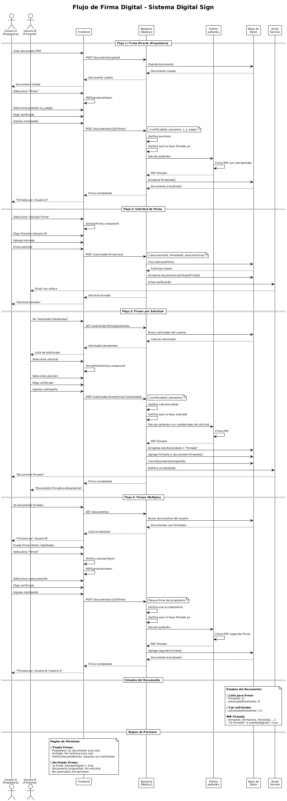

# Sistema de Firmas Electrónicas

Este proyecto es un sistema web completo para la gestión y aplicación de firmas electrónicas en documentos PDF. Cuenta con una arquitectura de cliente-servidor (frontend y backend) que permite a los usuarios subir, visualizar, descargar, eliminar y **firmar digitalmente** documentos PDF con certificados digitales.

## 📊 Arquitectura del Sistema

### Diagrama de Flujo de la Aplicación

El siguiente diagrama muestra el flujo completo de la aplicación, incluyendo las interacciones entre usuarios, el sistema de autenticación, gestión de documentos, solicitudes de firma y el proceso de firma digital.



**Descripción del Flujo:**

1. **Autenticación**: Los usuarios se registran o inician sesión con verificación de email
2. **Gestión de Documentos**: Subida, visualización y gestión de documentos PDF
3. **Sistema de Certificados**: Generación, subida y gestión de certificados digitales
4. **Solicitudes de Firma**: Un usuario puede solicitar a otro que firme su documento
5. **Proceso de Firma**: Firma digital con posicionamiento y validación
6. **Validación de PDFs**: Verificación de integridad y autenticidad de documentos firmados

**Componentes Principales:**
- **Frontend (React)**: Interfaz de usuario moderna y responsive
- **Backend (Node.js)**: API REST con autenticación JWT
- **Python (pyHanko)**: Microservicio para firma digital de PDFs
- **MongoDB**: Base de datos para documentos, usuarios y certificados
- **Email Service**: Notificaciones automáticas por email

## ✨ Nuevas Funcionalidades (v2.0)

### 🔐 Sistema de Autenticación Mejorado
- **Registro con validación de email**: Verificación por código de 6 dígitos
- **Política de contraseñas robusta**: Mínimo 8 caracteres, mayúscula, minúscula y número
- **Recuperación de contraseña**: Enlace seguro por email con expiración de 1 hora
- **Cambio de contraseña**: Desde el perfil del usuario con validación de contraseña actual
- **Sesiones seguras**: JWT con invalidación de tokens al cerrar sesión
- **Modal de error de contraseña**: Interfaz específica para credenciales incorrectas con consejos útiles

### 📧 Sistema de Email Integrado
- **Verificación de registro**: Email automático con código de confirmación
- **Recuperación de contraseña**: Enlace seguro para restablecer contraseña
- **Plantillas HTML profesionales**: Diseño responsive y branding consistente
- **Configuración Gmail**: Soporte para contraseñas de aplicación

### 👤 Gestión de Perfil de Usuario
- **Perfil simplificado**: Solo información esencial (nombre, email, fecha de registro)
- **Edición de datos**: Actualización de nombre y email con re-verificación
- **Fecha de registro**: Muestra fecha y hora exacta de creación de cuenta
- **Estado de cuenta**: Indicador visual del estado de verificación

### 🔍 Validación de PDFs Firmados
- **Validación de integridad**: Verifica si el PDF fue modificado después de la firma
- **Validación de origen**: Confirma si el PDF fue firmado por nuestro sistema
- **Verificación de certificado**: Valida el certificado usado para firmar
- **Extracción de información QR**: Lee datos del firmante desde el QR integrado
- **Validación por archivo o URL**: Soporte para subir archivo o validar desde URL
- **Información detallada**: Muestra número de firmas, estado de certificado, etc.

### 🤝 Sistema de Solicitudes de Firma (NUEVO)
- **Solicitar firma a otros usuarios**: Un usuario puede pedirle a otro que firme su documento
- **Notificaciones por email**: El firmante recibe un email con el enlace para firmar
- **Posicionamiento automático**: La firma se posiciona automáticamente donde el solicitante eligió
- **Gestión de solicitudes**: Dashboard para ver solicitudes pendientes y enviadas
- **Estados de solicitud**: Pendiente, firmado, rechazado, expirado
- **Expiración automática**: Las solicitudes expiran en 7 días
- **Mensajes personalizados**: El solicitante puede agregar un mensaje para el firmante
- **Permisos inteligentes**: Los firmantes pueden ver documentos que no son suyos si tienen una solicitud válida

### 🔄 Sistema de Firmas Múltiples (NUEVO)
- **Firmas múltiples por documento**: Cada usuario puede firmar una vez por documento
- **Firma del propietario**: El propietario puede firmar su propio documento
- **Firmas por solicitud**: Usuarios invitados pueden firmar por solicitud
- **Estados inteligentes**: El sistema detecta si el usuario ya firmó
- **Botones dinámicos**: Se habilitan/deshabilitan según permisos
- **Historial de firmas**: Lista completa de quién firmó y cuándo
- **Documentos compartidos**: Los firmantes pueden ver documentos después de firmar
- **Contador de firmas**: Muestra el número total de firmas en el documento
- **Posicionamiento automático**: Las firmas se posicionan automáticamente para evitar superposición

### 🛡️ Seguridad y Privacidad
- **Filtrado por usuario**: Cada usuario solo ve sus propios documentos
- **Validación de propiedad**: Verificación de permisos en todas las operaciones
- **Middleware de autenticación**: Protección de rutas sensibles
- **Mensajes de seguridad**: No revela si un email existe o no
- **Permisos de documentos**: Los firmantes pueden acceder temporalmente a documentos ajenos

## 🚀 Instalación

### Prerrequisitos

- **Node.js** 16+ y npm
- **Python** 3.8+ y pip
- **MongoDB** (local o Atlas)

## Despliegue en Azure (Guía rápida)

> Esta guía resume el despliegue de la plataforma (frontend + backend + MongoDB + Nginx + Fail2ban) en una VM Ubuntu usando Docker Compose.

### 1) Requisitos
- Ubuntu 20.04+ (VM en Azure)
- Puertos abiertos en Azure NSG/Subred: 22, 80, 443 (inbound)
- Dominio apuntando a la IP pública (ej.: af-systemstechnology.com)
- Docker y docker-compose instalados (los scripts ya los instalan si hace falta)

### 2) Estructura en la VM
Coloca el proyecto en `/tmp/cibersegu_app` (o `/var/www/cibersegu`). Los archivos clave:
- `deployment/docker-compose.yml`
- `deployment/nginx.conf`
- `deployment/scripts/*.sh`
- `backend/Dockerfile`, `frontend/Dockerfile`

### 3) Levantar servicios (con sudo)
```bash
cd /tmp/cibersegu_app/deployment
sudo docker-compose down
sudo docker-compose build --no-cache
sudo docker-compose up -d
sudo docker-compose ps
```

### 4) Health checks
```bash
# Nginx (proxy)
sudo curl -sk -H 'Host: af-systemstechnology.com' https://localhost/health
# Backend API
sudo curl -sk -H 'Host: af-systemstechnology.com' https://localhost/api/health | jq . || sudo curl -sk -H 'Host: af-systemstechnology.com' https://localhost/api/health
```
Scripts útiles:
```bash
cd /tmp/cibersegu_app/deployment
sudo chmod +x scripts/*.sh
sudo ./scripts/quick-health.sh
sudo ./scripts/health-check.sh
sudo ./scripts/db-diagnostic.sh
```

### 5) Certificados SSL (Let’s Encrypt)
Si el puerto 80 está ocupado por el Nginx del contenedor, usa modo standalone para emitir y copia al volumen `deployment/ssl`:
```bash
cd /tmp/cibersegu_app/deployment
# parar solo nginx del compose
sudo docker-compose stop nginx
# emitir cert (requiere DNS al día)
sudo certbot certonly --standalone \
  -d af-systemstechnology.com -d www.af-systemstechnology.com \
  --email TU_EMAIL --agree-tos --no-eff-email
# copiar al volumen que usa Nginx del compose
sudo mkdir -p ssl/certs ssl/private
sudo cp /etc/letsencrypt/live/af-systemstechnology.com/fullchain.pem ssl/certs/tu-dominio.crt
sudo cp /etc/letsencrypt/live/af-systemstechnology.com/privkey.pem   ssl/private/tu-dominio.key
# reactivar nginx
sudo docker-compose up -d --force-recreate --no-deps nginx
```
Renovación automática (cron de root):
```bash
# editar crontab: sudo crontab -e
0 3 * * * /usr/bin/certbot renew --quiet \
  --pre-hook "/usr/local/bin/docker-compose -f /tmp/cibersegu_app/deployment/docker-compose.yml stop nginx" \
  --deploy-hook "cp /etc/letsencrypt/live/af-systemstechnology.com/fullchain.pem /tmp/cibersegu_app/deployment/ssl/certs/tu-dominio.crt; cp /etc/letsencrypt/live/af-systemstechnology.com/privkey.pem /tmp/cibersegu_app/deployment/ssl/private/tu-dominio.key" \
  --post-hook "/usr/local/bin/docker-compose -f /tmp/cibersegu_app/deployment/docker-compose.yml up -d nginx"
```
(Usa `/usr/bin/docker compose` si tu entorno no tiene `docker-compose` clásico.)

### 6) Variables sensibles (no commitear)
Crea `deployment/docker-compose.override.yml` en la VM para credenciales (usa tus propios valores):
```yaml
services:
  backend:
    environment:
      # Mongo (ejemplo)
      - MONGODB_URI=mongodb://<USER>:<URL_ENCODED_PASSWORD>@mongodb:27017/firmasDB?authSource=admin
      # Email (Gmail con App Password de 16 caracteres sin espacios)
      - EMAIL_USER=<EMAIL_USER>
      - EMAIL_PASS=<EMAIL_APP_PASSWORD>
      - EMAIL_HOST=smtp.gmail.com
      - EMAIL_PORT=465
      - EMAIL_SECURE=true
      # WhatsApp (UltraMsg)
      - ULTRAMSG_INSTANCE=<ULTRAMSG_INSTANCE_ID>
      - ULTRAMSG_TOKEN=<ULTRAMSG_TOKEN>
```
Aplicar cambios:
```bash
cd /tmp/cibersegu_app/deployment
sudo docker-compose up -d --force-recreate backend
```

### 7) Frontend detrás de Nginx
- El frontend se sirve vía el contenedor `frontend` (Nginx interno). El proxy principal `deployment/nginx.conf` redirige `/` a `frontend:80` y `/api/` a `backend:3001`.
- Asegúrate de que el frontend no use `http://localhost:3001`. En `frontend/src/services/api.js` se usa `VITE_API_URL` o por defecto `/api`.
- Rebuild frontend cuando cambies assets:
```bash
cd /tmp/cibersegu_app/deployment
sudo docker-compose build --no-cache frontend
sudo docker-compose up -d frontend nginx
```

### 8) Troubleshooting rápido
- Backend reinicia con error `buffermaxentries`: reconstruye con el `db.js` actualizado y `--no-cache`.
- 404 en `/api/usuarios/registro`: revisa `deployment/nginx.conf` para que los `location` de login/registro NO estén anidados y tengan `proxy_pass`.
- 403 al probar con curl: envía un User-Agent de navegador (`-A 'Mozilla/5.0'`) o ajusta el bloqueo de UAs en `nginx.conf`.
- Firma 500 por `qpdf`/`qrcode`:
  - `backend/Dockerfile`: añade `qpdf` al `apt-get install`.
  - `backend/MicroservicioPyHanko/requirements.txt`: añade `qrcode[pil]==7.4.2`.
  - Rebuild backend.
- Email 535 (Gmail): usar App Password de la misma cuenta y configurar `EMAIL_HOST/PORT/SECURE`. Verifica dentro del contenedor con `env`.
- WhatsApp 500 (UltraMsg): si la instancia está “Stopped due to non-payment”, reactivar o usar email mientras tanto.

### 9) Comandos útiles
```bash
# Estado / logs
cd /tmp/cibersegu_app/deployment
sudo docker-compose ps
sudo docker-compose logs -f backend
sudo docker-compose logs -f nginx

# Reconstruir servicios puntuales
sudo docker-compose build --no-cache backend
sudo docker-compose up -d backend

# Diagnóstico rápido
sudo ./scripts/quick-health.sh
sudo ./scripts/health-check.sh
sudo ./scripts/db-diagnostic.sh
```

---

## 🔐 Firma Digital con pyHanko

El sistema ahora utiliza **pyHanko** (Python) para crear firmas digitales válidas que son reconocidas por Adobe y otros validadores de PDF.

## 📧 Sistema de Email y Autenticación

### Flujo de Registro con Verificación
1. **Usuario se registra** → Sistema valida datos y política de contraseñas
2. **Email de verificación** → Se envía código de 6 dígitos por email
3. **Verificación de código** → Usuario ingresa código para activar cuenta
4. **Cuenta activada** → Usuario puede iniciar sesión normalmente

### Flujo de Recuperación de Contraseña
1. **Usuario olvida contraseña** → Clic en "¿Olvidaste tu contraseña?"
2. **Ingresa email** → Sistema envía enlace seguro por email
3. **Clic en enlace** → Llega a página de restablecimiento
4. **Nueva contraseña** → Sistema valida y actualiza contraseña
5. **Redirección** → Usuario vuelve al login automáticamente

### Cambio de Contraseña desde Perfil
1. **Acceso al perfil** → Usuario va a "Mi Perfil"
2. **Botón cambiar contraseña** → Abre modal de cambio
3. **Validación actual** → Sistema verifica contraseña actual
4. **Nueva contraseña** → Validación de política de seguridad
5. **Confirmación** → Contraseña actualizada exitosamente

### Política de Contraseñas
- **Mínimo 8 caracteres**
- **Al menos una letra mayúscula**
- **Al menos una letra minúscula**
- **Al menos un número**
- **Barra de fortaleza en tiempo real**
- **Validación en frontend y backend**

### Flujo de Firma Digital

1. **Usuario selecciona posición**: Hace clic en el PDF para elegir dónde aparecerá la firma
2. **Extracción de datos**: El sistema extrae nombre y organización del certificado .p12
3. **Firma con pyHanko**: Se ejecuta el microservicio Python que:
   - Crea una firma digital criptográficamente válida
   - Integra un QR code con los datos del firmante
   - Posiciona el sello visual en coordenadas fijas optimizadas
4. **Descarga**: El PDF firmado se descarga automáticamente

### 🎯 Sistema de Posicionamiento de Firmas

#### **Coordenadas Fijas Optimizadas:**
- **Primera firma**: Posición izquierda `(100, 112, 210, 200)`
- **Solicitudes de firma**: Posición derecha `(380, 112, 510, 200)`
- **Detección automática**: El sistema detecta si es primera firma o solicitud
- **Evita superposición**: Las firmas múltiples se posicionan automáticamente

#### **Lógica de Posicionamiento:**
- **Sig1 (Primera firma)**: Lado izquierdo del documento
- **Sig2, Sig3, etc. (Solicitudes)**: Lado derecho del documento
- **Coordenadas hardcodeadas**: Posiciones fijas para consistencia
- **Tamaño estándar**: 110x88 puntos (aproximadamente 3.9x3.1 cm)

### 🔄 Flujo de Solicitudes de Firma (NUEVO)

#### **Paso 1: Solicitar Firma**
1. **Usuario A** sube un documento y selecciona una posición de firma
2. **Hace clic en "Solicitar Firma"** en el visor de PDF
3. **Selecciona un firmante** de la lista de usuarios verificados
4. **Agrega un mensaje personalizado** (opcional)
5. **Envía la solicitud** → Sistema crea registro en base de datos

#### **Paso 2: Notificación al Firmante**
1. **Sistema envía email** al firmante con:
   - Enlace directo para firmar el documento
   - Información del solicitante
   - Mensaje personalizado (si se agregó)
   - Fecha de expiración (7 días)
2. **Email incluye botón** "Firmar Documento" que lleva directamente a la página

#### **Paso 3: Firmante Recibe Solicitud**
1. **Firmante hace clic** en el enlace del email
2. **Sistema verifica** que la solicitud esté pendiente y no haya expirado
3. **Muestra página de firma** con:
   - Vista previa del documento
   - Información de la solicitud
   - Selector de certificado
   - Campo para contraseña del certificado
   - Botones "Firmar" y "Rechazar"

#### **Paso 4: Proceso de Firma**
1. **Firmante selecciona** su certificado digital
2. **Ingresa la contraseña** del certificado
3. **Hace clic en "Firmar"** → Sistema:
   - Desencripta el certificado
   - Ejecuta pyHanko con las coordenadas predefinidas
   - Actualiza el documento con la nueva firma
   - Marca la solicitud como "firmado"
   - Envía email de confirmación al solicitante

#### **Paso 5: Confirmación**
1. **Sistema envía email** al solicitante confirmando que el documento fue firmado
2. **Documento actualizado** aparece en la lista del solicitante
3. **Firmante es redirigido** a la página principal

#### **Estados de Solicitud:**
- **🟡 Pendiente**: Solicitud enviada, esperando respuesta
- **🟢 Firmado**: Documento firmado exitosamente
- **🔴 Rechazado**: Firmante rechazó la solicitud
- **⚫ Expirado**: Pasaron 7 días sin respuesta

#### **Permisos Inteligentes:**
- **Propietario del documento**: Puede ver y gestionar su documento normalmente
- **Firmante con solicitud válida**: Puede acceder temporalmente al documento para firmarlo
- **Otros usuarios**: No pueden acceder al documento
- **Solicitudes expiradas**: Se marcan automáticamente como expiradas

### 🔄 Flujo de Firmas Múltiples (NUEVO)

#### **Escenario 1: Propietario firma primero**
1. **Usuario A** sube documento → Documento aparece como "Listo para firmar"
2. **Usuario A** puede firmar → Botón "Firmar" habilitado
3. **Usuario A** firma → Documento muestra "Firmado por: Usuario A"
4. **Usuario A** solicita firma a **Usuario B** → Solicitud enviada
5. **Usuario B** firma → Documento muestra "Firmado por: Usuario A, Usuario B"

#### **Escenario 2: Invitado firma primero**
1. **Usuario A** sube documento → Documento aparece como "Listo para firmar"
2. **Usuario A** solicita firma a **Usuario B** → Solicitud enviada
3. **Usuario B** firma → Documento muestra "Firmado por: Usuario B"
4. **Usuario A** puede firmar → Botón "Firmar" habilitado
5. **Usuario A** firma → Documento muestra "Firmado por: Usuario B, Usuario A"

#### **Reglas de Firmas Múltiples:**
- ✅ **Cada usuario puede firmar una vez** por documento
- ✅ **El propietario puede firmar** su propio documento
- ✅ **Los invitados pueden firmar** por solicitud de firma
- ✅ **Documentos compartidos** requieren solicitud de firma
- ❌ **No se permiten firmas duplicadas** del mismo usuario
- ❌ **No se puede firmar** documentos ajenos sin solicitud

#### **Estados del Documento:**
- **🟢 "Listo para firmar"**: Documento nuevo, propietario puede firmar
- **🟡 "X solicitud(es) pendiente(s)"**: Con solicitudes activas
- **🔵 "Firmado por: X, Y"**: Con firmas, muestra lista de firmantes
- **📝 "Ya firmaste"**: Se muestra si el usuario actual ya firmó

#### **Botones Inteligentes:**
- **Habilitado**: Usuario puede firmar (propietario o con solicitud)
- **Deshabilitado**: Usuario ya firmó o no tiene permisos
- **Tooltip informativo**: Explica por qué está habilitado/deshabilitado

### Características de la Firma

- ✅ **Firma Válida**: Adobe y otros lectores reconocen la firma como válida
- ✅ **QR Integrado**: El QR es parte del sello oficial de la firma
- ✅ **Posicionamiento Automático**: Las firmas se posicionan automáticamente para evitar superposición
- ✅ **Datos del Certificado**: Nombre y organización se extraen automáticamente
- ✅ **Coordenadas Fijas**: Posiciones optimizadas para consistencia visual
- ✅ **Detección Inteligente**: El sistema detecta si es primera firma o solicitud

### Estructura del Sello Visual

El sello incluye:
- **QR Code**: Contiene nombre, email y organización del firmante
- **Texto**: "Firmado electrónicamente por: [NOMBRE] [ORGANIZACIÓN]"
- **Validación**: "Validar únicamente con Digital Sign PUCESE"

### Dependencias

**Backend Node.js:**
- `child_process` (para ejecutar Python)
- `tmp` (archivos temporales)
- `node-forge` (extracción de datos del certificado)
- `pdf-lib` (cálculo de coordenadas)
- `nodemailer` (envío de emails)
- `bcrypt` (encriptación de contraseñas)
- `jsonwebtoken` (tokens de autenticación)
- `dotenv` (variables de entorno)

**Microservicio Python:**
- `pyhanko>=1.8.0` (firma digital)
- `cryptography>=3.4.8` (operaciones criptográficas)

### Instalación de Python

```bash
# En el directorio backend/MicroservicioPyHanko
pip install -r requirements.txt
```

### Gestión de Certificados Digitales

El sistema ahora genera **certificados compatibles con pyHanko** usando OpenSSL directamente:

#### **Características de los Certificados:**

- **✅ Compatibles con pyHanko**: Todos los certificados generados son compatibles con el sistema de firma digital
- **🔐 RSA 2048 bits**: Claves criptográficas seguras
- **📋 Datos limpios**: Solo caracteres ASCII para máxima compatibilidad
- **🏢 Firmados por CA**: Todos los certificados están firmados por la CA interna del sistema
- **📦 Formato PKCS#12**: Estándar compatible con todos los sistemas

#### **Generación de Certificados:**

```bash
POST /api/certificados/generate
{
  "commonName": "Nombre del Usuario",
  "organization": "Organización",
  "organizationalUnit": "Departamento",
  "locality": "Ciudad",
  "state": "Provincia", 
  "country": "EC",
  "email": "usuario@ejemplo.com",
  "password": "contraseña_segura"
}
```

#### **Limpieza Automática de Datos:**

El sistema limpia automáticamente los datos para compatibilidad:
- **Nombres**: Solo letras, números y espacios
- **Organizaciones**: Sin caracteres especiales
- **Emails**: Solo caracteres válidos de email
- **Ubicaciones**: Solo texto alfanumérico

#### **Ventajas vs Certificados Anteriores:**

| Aspecto | Anterior (node-forge) | Actual (OpenSSL) |
|---------|----------------------|------------------|
| **Compatibilidad pyHanko** | ❌ Caracteres especiales | ✅ Solo ASCII |
| **Firma Digital** | ⚠️ Posibles errores | ✅ 100% compatible |
| **Estándar** | ⚠️ Formato variable | ✅ PKCS#12 estándar |
| **Validación** | ❌ Falla en pyHanko | ✅ Pasa todas las pruebas |

### Archivos del Sistema

**Backend:**
- `backend/src/controllers/documentoController.js`: Controlador principal de documentos con coordenadas fijas
- `backend/src/controllers/usuarioController.js`: Controlador de usuarios y autenticación
- `backend/src/controllers/validacionController.js`: Controlador de validación de PDFs
- `backend/src/controllers/solicitudFirmaController.js`: Controlador de solicitudes de firma (NUEVO)
- `backend/src/services/emailService.js`: Servicio de envío de emails
- `backend/src/models/Usuario.js`: Modelo de usuario con campos de verificación
- `backend/src/models/SolicitudFirma.js`: Modelo de solicitudes de firma (NUEVO)
- `backend/src/middleware/auth.js`: Middleware de autenticación JWT
- `backend/src/config/email.js`: Configuración de email
- `backend/src/utils/pdfValidator.js`: Utilidad para validar PDFs firmados
- `backend/MicroservicioPyHanko/firmar-pdf.py`: Script de Python para pyHanko con posicionamiento automático
- `backend/MicroservicioPyHanko/requirements.txt`: Dependencias Python
- `backend/CrearCACentral/ca.crt`: Certificado CA del sistema (no se sube al repo)

**Frontend:**
- `frontend/src/components/auth/LoginForm.jsx`: Formulario de login con modal de error de contraseña
- `frontend/src/components/auth/PasswordErrorModal.jsx`: Modal específico para errores de credenciales
- `frontend/src/components/auth/RegisterForm.jsx`: Registro con verificación de email
- `frontend/src/components/auth/ForgotPasswordModal.jsx`: Modal de recuperación
- `frontend/src/components/auth/RecuperarContrasenaPage.jsx`: Página de restablecimiento
- `frontend/src/components/profile/ProfilePage.jsx`: Perfil de usuario
- `frontend/src/components/profile/ChangePasswordModal.jsx`: Modal de cambio de contraseña
- `frontend/src/components/auth/PasswordStrengthBar.jsx`: Barra de fortaleza de contraseña
- `frontend/src/components/validacion/PDFValidationPage.jsx`: Página de validación de PDFs
- `frontend/src/components/documentos/SolicitarFirma.jsx`: Modal para solicitar firma (NUEVO)
- `frontend/src/components/documentos/SolicitudesPendientes.jsx`: Página de solicitudes pendientes (NUEVO)
- `frontend/src/components/documentos/FirmarPorSolicitud.jsx`: Página para firmar por solicitud (NUEVO)
- `frontend/src/components/documentos/PDFViewerEmbedded.jsx`: Visor de PDF embebido (NUEVO)

### Ventajas vs Implementación Anterior

| Aspecto | Anterior (Node.js) | Actual (pyHanko) |
|---------|-------------------|------------------|
| **Validez de Firma** | ❌ "Invalid" en Adobe | ✅ Válida en Adobe |
| **QR Code** | 📍 Posicionamiento libre | 🔗 Integrado en sello |
| **Estándar PDF** | ⚠️ Modificación post-firma | ✅ Cumple PDF/A |
| **Validación** | ❌ Falla validación criptográfica | ✅ Pasa validación |

### 📊 Modelos de Datos (NUEVO)

#### **Modelo SolicitudFirma:**
```javascript
{
  documentoId: ObjectId,        // Referencia al documento
  solicitanteId: ObjectId,      // Usuario que solicita la firma
  firmanteId: ObjectId,         // Usuario que debe firmar
  posicionFirma: {              // Coordenadas de la firma
    x: Number,
    y: Number,
    page: Number,
    qrSize: Number
  },
  mensaje: String,              // Mensaje personalizado
  estado: String,               // 'pendiente', 'firmado', 'rechazado', 'expirado'
  fechaSolicitud: Date,
  fechaExpiracion: Date,        // 7 días después
  fechaFirma: Date,             // Cuando se firma
  certificadoId: ObjectId,      // Certificado usado para firmar
  prioridad: String,            // 'baja', 'media', 'alta'
  comentarios: String           // Comentarios adicionales
}
```

#### **Modelo Documento (Actualizado):**
```javascript
{
  // ... campos existentes ...
  esDocumentoCompartido: Boolean,    // Si tiene solicitudes de firma
  solicitudesFirma: [ObjectId],      // Array de IDs de solicitudes
  firmantes: [{                      // Información de firmantes
    usuarioId: ObjectId,
    nombre: String,
    email: String,
    fechaFirma: Date,
    posicion: {
      x: Number,
      y: Number,
      page: Number
    }
  }]
}
```

#### **Permisos Inteligentes:**
- **Propietario**: Acceso completo al documento
- **Firmante con solicitud válida**: Acceso temporal para firmar
- **Otros usuarios**: Sin acceso al documento
- **Solicitudes expiradas**: Se marcan automáticamente

### Seguridad y Privacidad

| Aspecto | Descripción |
|---------|-------------|
| **Filtrado por Usuario** | Cada usuario solo ve sus propios documentos |
| **Validación de Propiedad** | Verificación de permisos en todas las operaciones |
| **Middleware de Autenticación** | Protección de rutas sensibles |
| **Tokens de Recuperación** | Expiración automática de 1 hora |
| **Política de Contraseñas** | Validación robusta en frontend y backend |
| **Mensajes de Seguridad** | No revela si un email existe o no |

### Notas Técnicas

- El certificado CA del sistema se copia temporalmente para cada firma
- Las coordenadas están hardcodeadas en el script Python para consistencia
- El sistema detecta automáticamente si es primera firma o solicitud de firma
- Los archivos temporales se limpian automáticamente después de cada firma
- Los tokens de recuperación se invalidan automáticamente después de su uso
- Las contraseñas se encriptan con bcrypt antes de almacenarse
- Los emails de verificación expiran después de 15 minutos
- El sistema soporta modo oscuro y claro en toda la interfaz
- El modal de error de contraseña detecta automáticamente errores de credenciales

## 🔧 API Endpoints

### Autenticación y Usuarios
- `POST /api/usuarios/registro` - Registro de usuario
- `POST /api/usuarios/login` - Inicio de sesión
- `POST /api/usuarios/logout` - Cerrar sesión
- `POST /api/usuarios/verificar-email` - Verificar email con código
- `POST /api/usuarios/reenviar-codigo` - Reenviar código de verificación
- `POST /api/usuarios/solicitar-recuperacion` - Solicitar recuperación de contraseña
- `POST /api/usuarios/restablecer-contrasena` - Restablecer contraseña con token
- `PUT /api/usuarios/cambiar-contrasena` - Cambiar contraseña desde perfil
- `GET /api/usuarios/perfil` - Obtener perfil de usuario
- `PUT /api/usuarios/perfil` - Actualizar perfil de usuario

### Documentos
- `GET /api/documentos` - Listar documentos del usuario
- `POST /api/documentos/subir` - Subir documento
- `POST /api/documentos/:id/firmar` - Firmar documento
- `GET /api/documentos/:id/download` - Descargar documento
- `DELETE /api/documentos/:id` - Eliminar documento

### Certificados
- `POST /api/certificados/generate` - Generar certificado
- `POST /api/certificados/upload` - Subir certificado
- `GET /api/certificados` - Listar certificados del usuario

### Validación
- `POST /api/validacion/validar-pdf` - Validar PDF subido
- `POST /api/validacion/validar-pdf-url` - Validar PDF desde URL
- `POST /api/validacion/informacion-firmas` - Obtener información detallada de firmas
- `POST /api/validacion/verificar-integridad` - Verificar integridad del PDF

### Solicitudes de Firma (NUEVO)
- `POST /api/solicitudes/crear` - Crear nueva solicitud de firma
- `GET /api/solicitudes/pendientes` - Listar solicitudes pendientes del usuario
- `GET /api/solicitudes/enviadas` - Listar solicitudes enviadas por el usuario
- `POST /api/solicitudes/firmar/:solicitudId` - Firmar documento por solicitud
- `POST /api/solicitudes/rechazar/:solicitudId` - Rechazar solicitud de firma
- `GET /api/solicitudes/:solicitudId` - Obtener detalles de una solicitud

## 🔧 Troubleshooting

### Problemas Comunes

**Error de Email:**
```
Error: Invalid login: 535-5.7.8 Username and Password not accepted.
```
**Solución:** Verificar que la contraseña de aplicación de Gmail sea correcta y que la verificación en 2 pasos esté activada.

**Error de Variables de Entorno:**
```
[dotenv@17.2.1] injecting env (6) from .env
```
**Solución:** Asegurarse de que `require('dotenv').config();` esté al inicio de `backend/src/app.js`.

**Error de Ruta de Recuperación:**
```
No routes matched location "/recuperar-contrasena?token=..."
```
**Solución:** Verificar que la ruta esté agregada en `frontend/src/App.jsx`.

**Documentos de Otro Usuario:**
Si ves documentos de otro usuario, verificar que el middleware de autenticación esté aplicado en todas las rutas de documentos.

**Error 403 al Cargar Documento:**
Si recibes error 403 al intentar cargar un documento para firmar, verificar:
1. Que tengas una solicitud de firma pendiente para ese documento
2. Que la solicitud no haya expirado (7 días)
3. Que el token de autenticación sea válido

**Solicitudes de Firma No Aparecen:**
Si no ves solicitudes de firma pendientes:
1. Verificar que el usuario tenga email verificado
2. Verificar que la solicitud esté en estado 'pendiente'
3. Verificar que no haya expirado (7 días)

**Email de Solicitud No Llega:**
Si el firmante no recibe el email:
1. Verificar configuración de email en `.env`
2. Verificar que el firmante tenga email verificado
3. Revisar logs del servidor para errores de email

**Modal de Error de Contraseña No Aparece:**
Si el modal de error de contraseña no se muestra:
1. Verificar que el backend esté enviando el mensaje "Credenciales inválidas"
2. Verificar que el frontend esté detectando correctamente los errores de credenciales
3. Revisar la consola del navegador para errores JavaScript

**Firmas Se Superponen:**
Si las firmas aparecen una encima de otra:
1. Verificar que el script Python esté usando las coordenadas fijas correctas
2. Verificar que la detección de primera firma vs solicitud funcione correctamente
3. Revisar los logs del backend para ver qué coordenadas se están usando

### Scripts de Diagnóstico

El proyecto incluye scripts de diagnóstico en el directorio `backend/`:
- `verify-env.js` - Verificar variables de entorno
- `test-system.js` - Probar funcionalidades del sistema
- `clear-test-users.js` - Limpiar usuarios de prueba
- `debug-registration.js` - Diagnosticar problemas de registro
- `test-validation.js` - Probar funcionalidad de validación de PDFs

**Uso del script de validación:**
```bash
# Probar validación básica
node test-validation.js

# Probar con un PDF firmado específico
node test-validation.js ruta/al/archivo-firmado.pdf
```